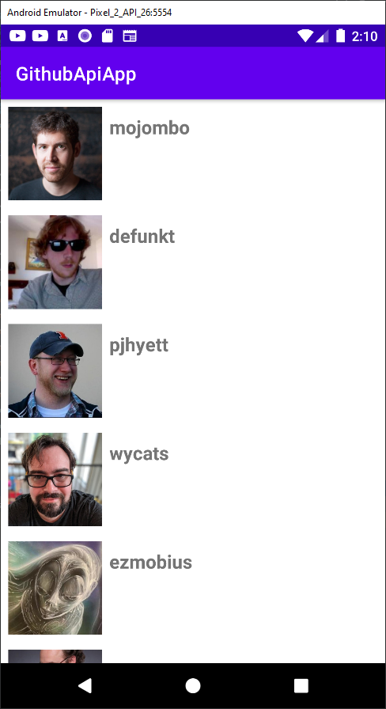
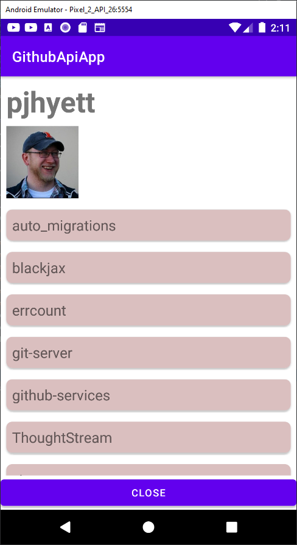
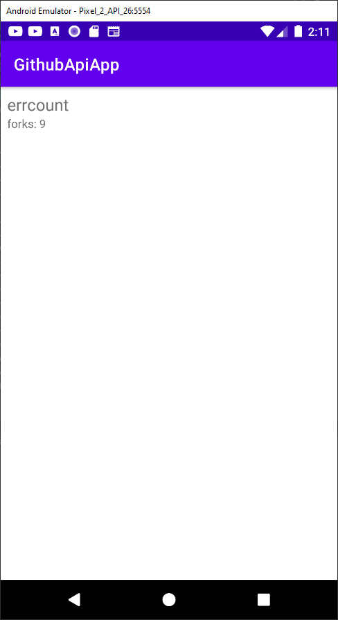

# Android: popular libraries:RxJava 2, Dagger 2, Moxy @geekbrains (https://gb.ru/go/aPWYkD)

Lesson2: Moxy, Router, Cicerone
App: GithubApiApp: list of users & simple details screen with Moxy&Cicerone

### Preview

Lesson3: RxJava
app changes: dataProvider on RxJava

Lesson4: EventBus (on RxJava)
app changes: like on EventBus

### Preview

Lesson5: Retrofit (with RxJava)
app changes: data from server through retrofit+rx, list of user repos and simple repo details

### Preview

Lesson6: Room (with RxJava)
app changes: data cached in Room using Rx

Lesson7: Dependency Injection: Koin
app changes: dependecy injected using Koin

