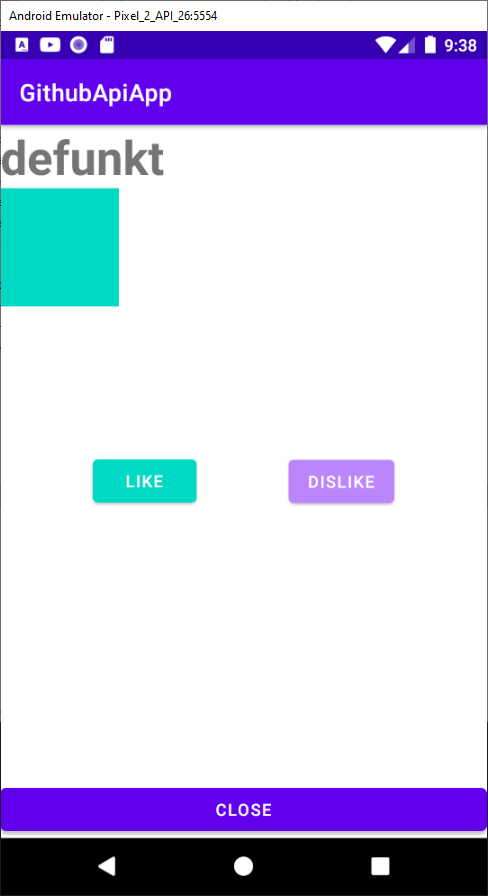

# Android: popular libraries:RxJava 2, Dagger 2, Moxy @geekbrains (https://gb.ru/go/aPWYkD)

Lesson2: Moxy, Router, Cicerone
App: GithubApiApp: list of users & simple details screen with Moxy&Cicerone

### Preview

Lesson3: RxJava
app changes: dataProvider on RxJava

Lesson3: EventBus (on RxJava)
app changes: like on EventBus

### Preview

